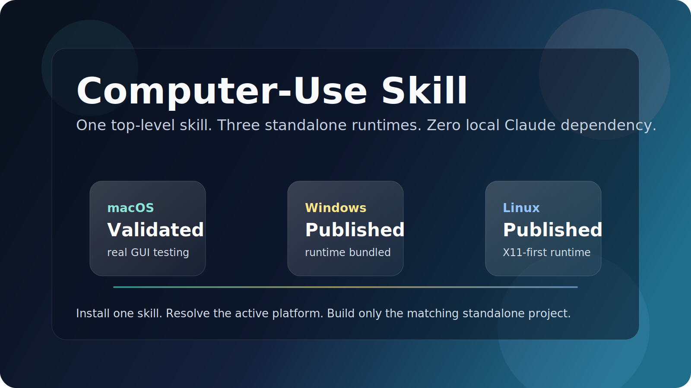
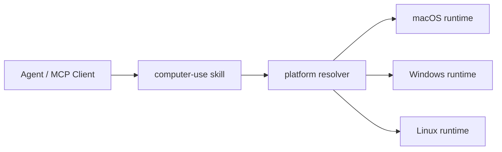

<div align="center">
  
  <h1>Computer-Use Skill</h1>
  <p><strong>macOS・Windows・Linux の standalone computer-use runtime をひとつに束ねたトップレベル skill。</strong></p>
  <p>
    <a href="https://github.com/wimi321/computer-use-skill">GitHub</a>
    ·
    <a href="https://clawhub.ai/wimi321/cross-platform-computer-use-skill">ClawHub</a>
    ·
    <a href="./README.md">English</a>
    ·
    <a href="./README.zh-CN.md">简体中文</a>
  </p>
</div>

## ClawHub からインストール

このトップレベル skill は ClawHub に [`cross-platform-computer-use-skill`](https://clawhub.ai/wimi321/cross-platform-computer-use-skill) として公開されています。

```bash
clawhub install cross-platform-computer-use-skill
```

## このプロジェクトの位置づけ

このリポジトリは:

- トップレベルの `skill`
- `macOS / Windows / Linux` をまとめる統一配布入口
- agent エコシステム向けの cross-platform portable computer-use パッケージ

として設計されています。まず 1 つの skill を入れ、その後でホスト環境に合う runtime を選ぶ形です。

## できること

- 1 つのトップレベル `cross-platform-computer-use-skill` skill
- `macOS`、`Windows`、`Linux` の standalone project を同梱
- 現在のホストに対応する project を返す platform resolver
- 各プラットフォームは引き続き public dependency のみ
- ローカル Claude インストールに依存しない
- GitHub と ClawHub の入口を 1 つに統合

## プラットフォーム行列

| Platform | 同梱 project | 現在の状態 |
| --- | --- | --- |
| macOS | `project/platforms/macos` | この環境で実機検証済み |
| Windows | `project/platforms/windows` | build・packaging・publish 済み、実機 E2E は未完了 |
| Linux | `project/platforms/linux` | build・packaging・publish 済み、実機 E2E は未完了 |

## 仕組み



トップレベル skill は 3 つの payload をまとめてインストールし、実行時にホストに合う project を選びます。

## インストール後の構成

```text
~/.codex/skills/cross-platform-computer-use-skill/
  SKILL.md
  scripts/
  project/
    manifest.json
    platforms/
      macos/
      windows/
      linux/
```

## 現在の platform project を取得

### Shell

```bash
bash ~/.codex/skills/cross-platform-computer-use-skill/scripts/current-project.sh
```

### PowerShell

```powershell
powershell -ExecutionPolicy Bypass -File $HOME/.codex/skills/cross-platform-computer-use-skill/scripts/current-project.ps1
```

### Node.js

```bash
node ~/.codex/skills/cross-platform-computer-use-skill/scripts/current-project.mjs
```

## Build と Run

```bash
cd "$(node ~/.codex/skills/cross-platform-computer-use-skill/scripts/current-project.mjs)"
npm install
npm run build
node dist/cli.js
```

## 現在の検証状況

実際に確認済みのもの:

- `macOS`: 実機での権限、スクリーンショット、clipboard、frontmost app、MCP `type` ラウンドトリップ、install 後の skill 動作
- `Windows`: TypeScript build、Python helper compile check、bundled payload 整合性、共有 shortcut guard 修正、skill publish
- `Linux`: TypeScript build、Python helper compile check、bundled payload 整合性、Linux platform guard 修正、skill publish

まだ実機検証が必要なもの:

- `Windows`: 実アプリに対する GUI 操作、UAC / 管理者ウィンドウ、focus edge case
- `Linux`: 実機 X11 GUI、Wayland の挙動、desktop environment 差異

## なぜトップレベル Skill なのか

3 つの独立 skill のままより、こちらの方がトップレベルプロジェクトとして強い形になります。

- インストール対象が 1 つで分かりやすい
- GitHub ブランドが集中する
- Codex、OpenClaw、OpenCode、TRAE など skill 系エコシステムに載せやすい
- それでも platform 差分は隠さず明示できる

## 関連する platform project

- [macOS Computer-Use Skill](https://github.com/wimi321/macos-computer-use-skill)
- [Windows Computer-Use Skill](https://github.com/wimi321/windows-computer-use-skill)
- [Linux Computer-Use Skill](https://github.com/wimi321/linux-computer-use-skill)

## License

MIT
