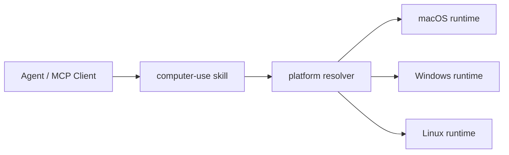

<div align="center">
  
  <h1>Computer-Use Skill</h1>
  <p><strong>macOS・Windows・Linux の standalone computer-use runtime をひとつに束ねたトップレベル skill。</strong></p>
  <p>
    
    
    
  </p>
  <p>
    <a href="https://github.com/wimi321/computer-use-skill">GitHub</a>
    ·
    <a href="https://clawhub.ai/wimi321/compuse">ClawHub</a>
    ·
    <a href="./README.md">English</a>
    ·
    <a href="./README.zh-CN.md">简体中文</a>
  </p>
</div>

<p align="center">
  <strong>一度インストール。</strong>
  実行時に現在のホストを自動判定。
  そのうえで各 platform runtime の独立性と可搬性は維持します。
</p>

## ひと目で分かること

| Install | Package | Positioning |
| --- | --- | --- |
| `clawhub install compuse` | 1 つのトップレベル skill | cross-platform の統一入口 |

## プロジェクト概要

| 項目 | 内容 |
| --- | --- |
| Packaging | `macOS`・`Windows`・`Linux` を束ねる 1 つのトップレベル skill |
| Runtime model | ローカル Claude install 不要の standalone payload 同梱型 |
| Public install name | [`compuse`](https://clawhub.ai/wimi321/compuse) |
| 現在の最強検証 | この workspace 上での macOS 実機検証 |

## なぜトップレベル project として強いか

- インストール先が 1 つで覚えやすい
- リポジトリのブランドと多言語 README がまとまっている
- bundled distribution でありつつ platform 差分は隠さない
- Codex、OpenClaw、OpenCode、TRAE などに載せやすい skill-first 入口

## この project の違い

- Claude desktop のローカル install や private asset 抽出を前提にしない
- macOS・Windows・Linux を無理に同一視せず、runtime 差分を明示したまま配布する
- install story は 1 つにまとめつつ、実装面は正直な構造を保っている

## ClawHub からインストール

このトップレベル skill は ClawHub に [`compuse`](https://clawhub.ai/wimi321/compuse) として公開されています。

```bash
clawhub install compuse
```

## このプロジェクトの位置づけ

このリポジトリは:

- トップレベルの `skill`
- `macOS / Windows / Linux` をまとめる統一配布入口
- agent エコシステム向けの cross-platform portable computer-use パッケージ

として設計されています。まず 1 つの skill を入れ、その後でホスト環境に合う runtime を選ぶ形です。

## クイックスタート

```bash
clawhub install compuse
cd ~/.codex/skills/compuse
bash scripts/current-project.sh
```

## 早見表

| 欲しいもの | この repo が提供するもの |
| --- | --- |
| 1 つの install target | `compuse` |
| 1 つの project identity | GitHub と ClawHub の統一入口 |
| cross-platform packaging | `macOS`・`Windows`・`Linux` payload 同梱 |
| 正直な status 表現 | platform ごとの検証範囲を明示 |

## できること

- 1 つのトップレベル `compuse` skill
- `macOS`、`Windows`、`Linux` の standalone project を同梱
- 現在のホストに対応する project を返す platform resolver
- 各プラットフォームは引き続き public dependency のみ
- ローカル Claude インストールに依存しない
- GitHub と ClawHub の入口を 1 つに統合

## プラットフォーム行列

| Platform | 同梱 project | 現在の状態 |
| --- | --- | --- |
| macOS | `project/platforms/macos` | この環境で実機検証済み |
| Windows | `project/platforms/windows` | build・packaging・publish 済み、実機 E2E は未完了 |
| Linux | `project/platforms/linux` | build・packaging・publish 済み、実機 E2E は未完了 |

## 仕組み



トップレベル skill は 3 つの payload をまとめてインストールし、実行時にホストに合う project を選びます。

## インストール後の構成

```text
~/.codex/skills/compuse/
  SKILL.md
  scripts/
  project/
    manifest.json
    platforms/
      macos/
      windows/
      linux/
```

## 現在の platform project を取得

### Shell

```bash
bash ~/.codex/skills/compuse/scripts/current-project.sh
```

### PowerShell

```powershell
powershell -ExecutionPolicy Bypass -File $HOME/.codex/skills/compuse/scripts/current-project.ps1
```

### Node.js

```bash
node ~/.codex/skills/compuse/scripts/current-project.mjs
```

## Build と Run

```bash
cd "$(node ~/.codex/skills/compuse/scripts/current-project.mjs)"
npm install
npm run build
node dist/cli.js
```

## 現在の検証状況

実際に確認済みのもの:

- `macOS`: 実機での権限、スクリーンショット、clipboard、frontmost app、MCP `type` ラウンドトリップ、install 後の skill 動作、raw typing 安定化修正、bootstrap 並行起動修正
- `Windows`: TypeScript build、Python helper compile check、bundled payload 整合性、共有 shortcut guard 修正、skill publish
- `Linux`: TypeScript build、Python helper compile check、bundled payload 整合性、Linux platform guard 修正、skill publish

まだ実機検証が必要なもの:

- `Windows`: 実アプリに対する GUI 操作、UAC / 管理者ウィンドウ、focus edge case
- `Linux`: 実機 X11 GUI、Wayland の挙動、desktop environment 差異

## 信頼境界

- この project は trusted local desktop automation 向け
- 現在の runtime は `screenshotFiltering: none` を返す
- 安全性は MCP layer、grant model、platform gating で担保しており、host の完全 sandbox を装わない
- README では実際に検証した内容だけを書き、未検証部分を誇張しない

## なぜトップレベル Skill なのか

3 つの独立 skill のままより、こちらの方がトップレベルプロジェクトとして強い形になります。

- インストール対象が 1 つで分かりやすい
- GitHub ブランドが集中する
- Codex、OpenClaw、OpenCode、TRAE など skill 系エコシステムに載せやすい
- それでも platform 差分は隠さず明示できる

## 関連する platform project

- [macOS Computer-Use Skill](https://github.com/wimi321/macos-computer-use-skill)
- [Windows Computer-Use Skill](https://github.com/wimi321/windows-computer-use-skill)
- [Linux Computer-Use Skill](https://github.com/wimi321/linux-computer-use-skill)

## 言語リンク

- [English](https://github.com/wimi321/computer-use-skill/blob/main/README.md)
- [简体中文](https://github.com/wimi321/computer-use-skill/blob/main/README.zh-CN.md)
- [日本語](https://github.com/wimi321/computer-use-skill/blob/main/README.ja.md)

## License

MIT
