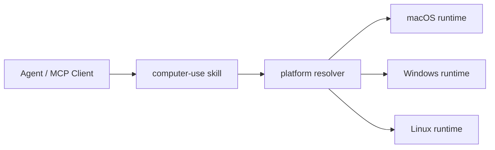

<div align="center">
  
  <h1>Computer-Use Skill</h1>
  <p><strong>One top-level skill that bundles standalone macOS, Windows, and Linux computer-use runtimes.</strong></p>
  <p>
    <a href="https://github.com/wimi321/computer-use-skill">GitHub</a>
    ·
    <a href="https://clawhub.ai/wimi321/computer-use">ClawHub</a>
    ·
    <a href="./README.zh-CN.md">简体中文</a>
    ·
    <a href="./README.ja.md">日本語</a>
  </p>
</div>

## Install From ClawHub

Published on ClawHub as [`computer-use`](https://clawhub.ai/wimi321/computer-use).

```bash
clawhub install computer-use
```

## Positioning

This repository is:

- one top-level `skill`
- one unified distribution for `macOS`, `Windows`, and `Linux`
- one portable skill-first entry point for agent ecosystems

Instead of asking users to pick a platform-specific package first, this repository ships one premium entry point and bundles the platform runtimes behind it.

## What You Get

- one top-level `computer-use` skill
- bundled standalone projects for `macOS`, `Windows`, and `Linux`
- platform-selection scripts that resolve the active host project
- public dependency chain only inside each runtime
- zero dependency on a local Claude installation
- one GitHub project and one ClawHub listing for the cross-platform story

## Platform Matrix

| Platform | Bundled project | Current status |
| --- | --- | --- |
| macOS | `project/platforms/macos` | real-device validated in this workspace |
| Windows | `project/platforms/windows` | built, packaged, published; real-host E2E still needed |
| Linux | `project/platforms/linux` | built, packaged, published; real-host E2E still needed |

## How It Works



The top-level skill installs all three runtime payloads once, then resolves the correct platform-specific project at use time.

## Installed Layout

After installation:

```text
~/.codex/skills/computer-use/
  SKILL.md
  scripts/
  project/
    manifest.json
    platforms/
      macos/
      windows/
      linux/
```

## Resolve The Active Project

### Shell

```bash
bash ~/.codex/skills/computer-use/scripts/current-project.sh
```

### PowerShell

```powershell
powershell -ExecutionPolicy Bypass -File $HOME/.codex/skills/computer-use/scripts/current-project.ps1
```

### Node.js

```bash
node ~/.codex/skills/computer-use/scripts/current-project.mjs
```

## Build And Run

```bash
cd "$(node ~/.codex/skills/computer-use/scripts/current-project.mjs)"
npm install
npm run build
node dist/cli.js
```

## Validation Status

What has actually been verified so far:

- `macOS`: real-device validation, permissions, screenshots, clipboard, frontmost-app checks, MCP typing round-trip, and installed-skill smoke tests
- `Windows`: TypeScript build, Python helper compile check, bundled payload integrity, shared blocklist fix, published skill
- `Linux`: TypeScript build, Python helper compile check, bundled payload integrity, explicit Linux platform-guard fix, published skill

What still needs real-host validation:

- `Windows`: GUI automation against real apps, UAC/admin windows, focus edge cases
- `Linux`: real X11 GUI automation, Wayland behavior, desktop-environment variance

## Why A Top-Level Skill

This setup gives the project a stronger shape than three unrelated platform packages:

- one memorable install target
- one premium README and one GitHub identity
- one skill name for Codex, OpenClaw, OpenCode, TRAE, and other skill-style ecosystems
- platform-specific runtimes remain explicit instead of being hidden behind false abstraction

## Related Platform Projects

- [macOS Computer-Use Skill](https://github.com/wimi321/macos-computer-use-skill)
- [Windows Computer-Use Skill](https://github.com/wimi321/windows-computer-use-skill)
- [Linux Computer-Use Skill](https://github.com/wimi321/linux-computer-use-skill)

## License

MIT
