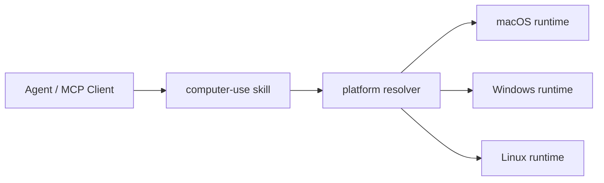

<div align="center">
  
  <h1>Computer-Use Skill</h1>
  <p><strong>One top-level skill that bundles standalone macOS, Windows, and Linux computer-use runtimes.</strong></p>
  <p>
    
    
    
  </p>
  <p>
    <a href="https://github.com/wimi321/computer-use-skill">GitHub</a>
    ·
    <a href="https://clawhub.ai/wimi321/compuse">ClawHub</a>
    ·
    <a href="./README.zh-CN.md">简体中文</a>
    ·
    <a href="./README.ja.md">日本語</a>
  </p>
</div>

<p align="center">
  <strong>Install once.</strong>
  Resolve the active host automatically.
  Keep each platform runtime explicit, portable, and independently testable.
</p>

## At A Glance

| Install | Package | Positioning |
| --- | --- | --- |
| `clawhub install compuse` | one top-level skill | one cross-platform entry point |

## Project Snapshot

| Track | What it means |
| --- | --- |
| Packaging | one top-level skill for `macOS`, `Windows`, and `Linux` |
| Runtime model | bundled standalone payloads, no local Claude install required |
| Public install target | [`compuse`](https://clawhub.ai/wimi321/compuse) |
| Current strongest validation | real-device macOS validation in this workspace |

## Why It Feels Premium

- one memorable install target instead of three disconnected packages
- one repository identity with multi-language documentation
- one bundled distribution that stays explicit about real platform differences
- one skill-first story for Codex, OpenClaw, OpenCode, TRAE, and similar ecosystems

## What Makes This Different

- it does not assume a local Claude desktop install, extracted private assets, or hidden native modules
- it keeps platform runtimes visible instead of pretending macOS, Windows, and Linux behave the same
- it ships as a top-level skill first, so the install story stays simple while the implementation stays honest

## Install From ClawHub

Published on ClawHub as [`compuse`](https://clawhub.ai/wimi321/compuse).

```bash
clawhub install compuse
```

## Positioning

This repository is:

- one top-level `skill`
- one unified distribution for `macOS`, `Windows`, and `Linux`
- one portable skill-first entry point for agent ecosystems

Instead of asking users to pick a platform-specific package first, this repository ships one premium entry point and bundles the platform runtimes behind it.

## Quick Start

```bash
clawhub install compuse
cd ~/.codex/skills/compuse
bash scripts/current-project.sh
```

## Fast Facts

| You want | This repo gives you |
| --- | --- |
| one install target | `compuse` |
| one repo identity | one GitHub project plus one ClawHub listing |
| cross-platform packaging | bundled payloads for `macOS`, `Windows`, `Linux` |
| a truthful status model | explicit validation notes per platform |

## What You Get

- one top-level `compuse` skill
- bundled standalone projects for `macOS`, `Windows`, and `Linux`
- platform-selection scripts that resolve the active host project
- public dependency chain only inside each runtime
- zero dependency on a local Claude installation
- one GitHub project and one ClawHub listing for the cross-platform story

## Platform Matrix

| Platform | Bundled project | Current status |
| --- | --- | --- |
| macOS | `project/platforms/macos` | real-device validated in this workspace |
| Windows | `project/platforms/windows` | built, packaged, published; real-host E2E still needed |
| Linux | `project/platforms/linux` | built, packaged, published; real-host E2E still needed |

## How It Works



The top-level skill installs all three runtime payloads once, then resolves the correct platform-specific project at use time.

## Installed Layout

After installation:

```text
~/.codex/skills/compuse/
  SKILL.md
  scripts/
  project/
    manifest.json
    platforms/
      macos/
      windows/
      linux/
```

## Resolve The Active Project

### Shell

```bash
bash ~/.codex/skills/compuse/scripts/current-project.sh
```

### PowerShell

```powershell
powershell -ExecutionPolicy Bypass -File $HOME/.codex/skills/compuse/scripts/current-project.ps1
```

### Node.js

```bash
node ~/.codex/skills/compuse/scripts/current-project.mjs
```

## Build And Run

```bash
cd "$(node ~/.codex/skills/compuse/scripts/current-project.mjs)"
npm install
npm run build
node dist/cli.js
```

## Validation Status

What has actually been verified so far:

- `macOS`: real-device validation, permissions, screenshots, clipboard, frontmost-app checks, MCP typing round-trip, installed-skill smoke tests, raw typing stability fix, and bootstrap concurrency fix
- `Windows`: TypeScript build, Python helper compile check, bundled payload integrity, shared blocklist fix, published skill
- `Linux`: TypeScript build, Python helper compile check, bundled payload integrity, explicit Linux platform-guard fix, published skill

What still needs real-host validation:

- `Windows`: GUI automation against real apps, UAC/admin windows, focus edge cases
- `Linux`: real X11 GUI automation, Wayland behavior, desktop-environment variance

## Trust Boundary

- this project is for trusted local desktop automation
- screenshots on current runtimes are reported as `screenshotFiltering: none`
- action safety is enforced by the MCP layer, grants, and platform gating, not by pretending the host is sandboxed
- the repository documents what was truly tested instead of claiming full parity where it does not exist

## Why A Top-Level Skill

This setup gives the project a stronger shape than three unrelated platform packages:

- one memorable install target
- one premium README and one GitHub identity
- one skill name for Codex, OpenClaw, OpenCode, TRAE, and other skill-style ecosystems
- platform-specific runtimes remain explicit instead of being hidden behind false abstraction

## Related Platform Projects

- [macOS Computer-Use Skill](https://github.com/wimi321/macos-computer-use-skill)
- [Windows Computer-Use Skill](https://github.com/wimi321/windows-computer-use-skill)
- [Linux Computer-Use Skill](https://github.com/wimi321/linux-computer-use-skill)

## Read In Your Language

- [English](https://github.com/wimi321/computer-use-skill/blob/main/README.md)
- [简体中文](https://github.com/wimi321/computer-use-skill/blob/main/README.zh-CN.md)
- [日本語](https://github.com/wimi321/computer-use-skill/blob/main/README.ja.md)

## License

MIT
