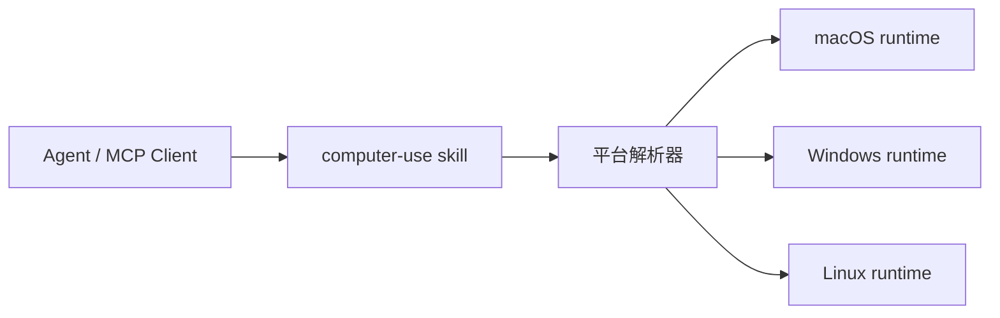

<div align="center">
  
  <h1>Computer-Use Skill</h1>
  <p><strong>一个顶级跨平台 skill，把独立的 macOS、Windows、Linux computer-use runtime 一次性打包好。</strong></p>
  <p>
    
    
    
  </p>
  <p>
    <a href="https://github.com/wimi321/computer-use-skill">GitHub</a>
    ·
    <a href="https://clawhub.ai/wimi321/compuse">ClawHub</a>
    ·
    <a href="./README.md">English</a>
    ·
    <a href="./README.ja.md">日本語</a>
  </p>
</div>

<p align="center">
  <strong>一次安装。</strong>
  自动解析当前主机平台。
  同时保留每个平台 runtime 的独立性、可移植性和可测试性。
</p>

## 一眼看懂

| 安装命令 | 包名 | 项目定位 |
| --- | --- | --- |
| `clawhub install compuse` | 一个顶级 skill | 一个跨平台统一入口 |

## 项目快照

| 维度 | 当前状态 |
| --- | --- |
| 打包方式 | 一个覆盖 `macOS`、`Windows`、`Linux` 的顶级 skill |
| 运行模型 | 内置独立 payload，不依赖本机 Claude 安装 |
| 公开安装名 | [`compuse`](https://clawhub.ai/wimi321/compuse) |
| 当前最强验证 | 本仓库所在机器上的 macOS 真机验证 |

## 为什么它像顶级项目

- 一个安装目标，而不是三个割裂的平台包
- 一个仓库品牌，配齐多语言文档
- 一个 bundled distribution，同时仍然明确呈现平台差异
- 一套 skill-first 入口，适合 Codex、OpenClaw、OpenCode、TRAE 等生态

## 这个项目真正不一样的地方

- 不要求本机先装 Claude desktop，也不依赖提取私有资源或隐藏 native 模块
- 不假装三平台完全一致，而是把平台差异保留在清晰可见的 runtime 里
- 先把安装入口做成一个顶级 skill，再把实现细节诚实地放在后面

## ClawHub 安装

这个顶级 skill 已发布到 ClawHub，slug 是 [`compuse`](https://clawhub.ai/wimi321/compuse)。

```bash
clawhub install compuse
```

## 项目定位

这个仓库是：

- 一个顶级 `skill`
- 一个统一的 `macOS / Windows / Linux` 分发入口
- 一个面向 agent 生态的跨平台 portable computer-use 技能包

它不要求用户先理解平台差异再挑包，而是先安装一个顶级 skill，再由它选择正确的平台运行时。

## 快速开始

```bash
clawhub install compuse
cd ~/.codex/skills/compuse
bash scripts/current-project.sh
```

## 快速信息

| 你想要的 | 这里提供的 |
| --- | --- |
| 一个安装目标 | `compuse` |
| 一个统一品牌入口 | 一个 GitHub 项目 + 一个 ClawHub 页面 |
| 跨平台分发 | 内置 `macOS`、`Windows`、`Linux` payload |
| 诚实的状态说明 | 每个平台独立验证说明 |

## 你会得到什么

- 一个顶级 `compuse` skill
- 内置 `macOS`、`Windows`、`Linux` 三个平台的独立项目
- 平台选择脚本，自动定位当前主机该使用哪个项目
- 各平台仍然只依赖公开依赖链
- 完全不依赖本机 Claude 安装
- 一个统一的 GitHub 项目和一个统一的 ClawHub 入口

## 平台矩阵

| 平台 | 内置项目 | 当前状态 |
| --- | --- | --- |
| macOS | `project/platforms/macos` | 已在这台机器上完成真实设备验证 |
| Windows | `project/platforms/windows` | 已构建、已打包、已发布，仍需真实 Windows 实机验证 |
| Linux | `project/platforms/linux` | 已构建、已打包、已发布，仍需真实 Linux 实机验证 |

## 工作方式



顶级 skill 会一次性安装三个平台 payload，然后在实际使用时解析当前平台并选中对应项目。

## 安装后的结构

```text
~/.codex/skills/compuse/
  SKILL.md
  scripts/
  project/
    manifest.json
    platforms/
      macos/
      windows/
      linux/
```

## 获取当前平台项目

### Shell

```bash
bash ~/.codex/skills/compuse/scripts/current-project.sh
```

### PowerShell

```powershell
powershell -ExecutionPolicy Bypass -File $HOME/.codex/skills/compuse/scripts/current-project.ps1
```

### Node.js

```bash
node ~/.codex/skills/compuse/scripts/current-project.mjs
```

## 构建与运行

```bash
cd "$(node ~/.codex/skills/compuse/scripts/current-project.mjs)"
npm install
npm run build
node dist/cli.js
```

## 当前验证状态

已经真实完成的：

- `macOS`：真实设备权限、截图、剪贴板、前台应用、MCP `type` 回读、安装态 skill 验证、raw typing 稳定性修复、bootstrap 并发修复
- `Windows`：TypeScript 构建、Python helper 编译、bundled payload 完整性、共享快捷键保护修复、已发布 skill
- `Linux`：TypeScript 构建、Python helper 编译、bundled payload 完整性、Linux 平台保护修复、已发布 skill

还需要真实主机验证的：

- `Windows`：真实应用 GUI 控制、UAC/管理员窗口、焦点边界
- `Linux`：真实 X11 GUI 控制、Wayland 行为、桌面环境差异

## 信任边界

- 这个项目面向可信本机环境下的桌面自动化
- 当前 runtime 报告的 `screenshotFiltering` 是 `none`
- 安全控制依赖 MCP 层、授权模型和平台 gate，而不是假装宿主本身被沙箱隔离
- 仓库只写真实验证过的能力，不伪造三平台完全同级的成熟度

## 为什么要做成顶级 Skill

相比三个彼此独立的平台包，这种做法更像真正的顶级项目：

- 一个更强的安装目标
- 一个更集中的 GitHub 品牌
- 一个统一的 skill 名称，适合 Codex、OpenClaw、OpenCode、TRAE 等 skill 生态
- 平台差异仍然明确，不会假装三平台完全一样

## 相关平台项目

- [macOS Computer-Use Skill](https://github.com/wimi321/macos-computer-use-skill)
- [Windows Computer-Use Skill](https://github.com/wimi321/windows-computer-use-skill)
- [Linux Computer-Use Skill](https://github.com/wimi321/linux-computer-use-skill)

## 多语言阅读

- [English](https://github.com/wimi321/computer-use-skill/blob/main/README.md)
- [简体中文](https://github.com/wimi321/computer-use-skill/blob/main/README.zh-CN.md)
- [日本語](https://github.com/wimi321/computer-use-skill/blob/main/README.ja.md)

## License

MIT
