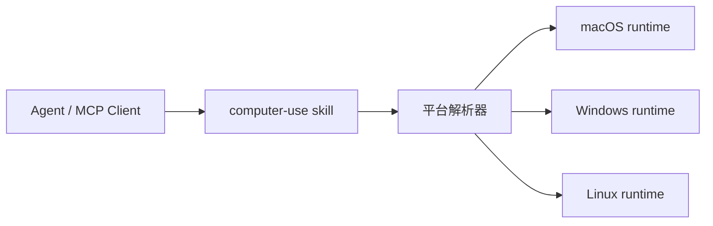

<div align="center">
  
  <h1>Computer-Use Skill</h1>
  <p><strong>一个顶级跨平台 skill，把独立的 macOS、Windows、Linux computer-use runtime 一次性打包好。</strong></p>
  <p>
    <a href="https://github.com/wimi321/computer-use-skill">GitHub</a>
    ·
    <a href="https://clawhub.ai/wimi321/computer-use">ClawHub</a>
    ·
    <a href="./README.md">English</a>
    ·
    <a href="./README.ja.md">日本語</a>
  </p>
</div>

## ClawHub 安装

这个顶级 skill 已发布到 ClawHub，slug 是 [`computer-use`](https://clawhub.ai/wimi321/computer-use)。

```bash
clawhub install computer-use
```

## 项目定位

这个仓库是：

- 一个顶级 `skill`
- 一个统一的 `macOS / Windows / Linux` 分发入口
- 一个面向 agent 生态的跨平台 portable computer-use 技能包

它不要求用户先理解平台差异再挑包，而是先安装一个顶级 skill，再由它选择正确的平台运行时。

## 你会得到什么

- 一个顶级 `computer-use` skill
- 内置 `macOS`、`Windows`、`Linux` 三个平台的独立项目
- 平台选择脚本，自动定位当前主机该使用哪个项目
- 各平台仍然只依赖公开依赖链
- 完全不依赖本机 Claude 安装
- 一个统一的 GitHub 项目和一个统一的 ClawHub 入口

## 平台矩阵

| 平台 | 内置项目 | 当前状态 |
| --- | --- | --- |
| macOS | `project/platforms/macos` | 已在这台机器上完成真实设备验证 |
| Windows | `project/platforms/windows` | 已构建、已打包、已发布，仍需真实 Windows 实机验证 |
| Linux | `project/platforms/linux` | 已构建、已打包、已发布，仍需真实 Linux 实机验证 |

## 工作方式



顶级 skill 会一次性安装三个平台 payload，然后在实际使用时解析当前平台并选中对应项目。

## 安装后的结构

```text
~/.codex/skills/computer-use/
  SKILL.md
  scripts/
  project/
    manifest.json
    platforms/
      macos/
      windows/
      linux/
```

## 获取当前平台项目

### Shell

```bash
bash ~/.codex/skills/computer-use/scripts/current-project.sh
```

### PowerShell

```powershell
powershell -ExecutionPolicy Bypass -File $HOME/.codex/skills/computer-use/scripts/current-project.ps1
```

### Node.js

```bash
node ~/.codex/skills/computer-use/scripts/current-project.mjs
```

## 构建与运行

```bash
cd "$(node ~/.codex/skills/computer-use/scripts/current-project.mjs)"
npm install
npm run build
node dist/cli.js
```

## 当前验证状态

已经真实完成的：

- `macOS`：真实设备权限、截图、剪贴板、前台应用、MCP `type` 回读、安装态 skill 验证
- `Windows`：TypeScript 构建、Python helper 编译、bundled payload 完整性、共享快捷键保护修复、已发布 skill
- `Linux`：TypeScript 构建、Python helper 编译、bundled payload 完整性、Linux 平台保护修复、已发布 skill

还需要真实主机验证的：

- `Windows`：真实应用 GUI 控制、UAC/管理员窗口、焦点边界
- `Linux`：真实 X11 GUI 控制、Wayland 行为、桌面环境差异

## 为什么要做成顶级 Skill

相比三个彼此独立的平台包，这种做法更像真正的顶级项目：

- 一个更强的安装目标
- 一个更集中的 GitHub 品牌
- 一个统一的 skill 名称，适合 Codex、OpenClaw、OpenCode、TRAE 等 skill 生态
- 平台差异仍然明确，不会假装三平台完全一样

## 相关平台项目

- [macOS Computer-Use Skill](https://github.com/wimi321/macos-computer-use-skill)
- [Windows Computer-Use Skill](https://github.com/wimi321/windows-computer-use-skill)
- [Linux Computer-Use Skill](https://github.com/wimi321/linux-computer-use-skill)

## License

MIT
