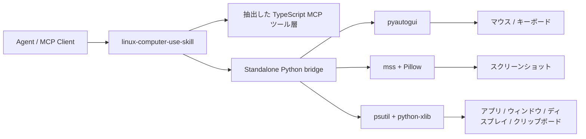

<div align="center">
  
  <h1>Linux Computer-Use Skill</h1>
  <p><strong>Linux 向けのトップレベル skill。standalone runtime と MCP server を同梱しています。</strong></p>
  <p>
    <a href="https://github.com/wimi321/linux-computer-use-skill">GitHub</a>
    ·
    <a href="https://clawhub.ai/wimi321/computer-use-linux">ClawHub</a>
    ·
    <a href="./README.md">English</a>
    ·
    <a href="./README.zh-CN.md">简体中文</a>
  </p>
</div>

## ClawHub からインストール

この skill は ClawHub に [`computer-use-linux`](https://clawhub.ai/wimi321/computer-use-linux) として公開済みです。

```bash
clawhub install computer-use-linux
```

## このプロジェクトの位置づけ

このリポジトリは同時に:

- トップレベルの `skill`
- 独立した Linux デスクトップ制御 runtime
- agent エコシステム向けの computer-use MCP server

として設計されています。ローカル Claude インストールには依存しません。

## このプロジェクトの目的

目標は次のとおりです。

- ローカル Claude に依存しない
- private な `.node` バイナリに依存しない
- 抽出済みの隠し資産に依存しない
- skill を入れて server を build すれば、そのまま使える

## できること

- トップレベル Linux computer-use skill
- スクリーンショット、マウス、キーボード、アプリ起動、ウィンドウ/ディスプレイ対応付け、クリップボードを扱う standalone MCP server
- 公開依存のみ: `Node.js + Python + pyautogui + mss + Pillow + psutil + python-xlib`
- 初回起動時に virtualenv を自動作成し、Python 依存を自動導入
- `~/.codex/skills/computer-use-linux/project` に本体まで配置される skill install
- 抽出した TypeScript tool layer を Linux-native Python backend に接続

## 現在の状態

このリポジトリで実装済み:

- Linux Python helper と runtime bootstrap
- ディスプレイ列挙とスクリーンショット経路
- マウス、キーボード、ドラッグ、スクロール、クリップボード
- 最前面アプリ、ポインタ下アプリ、実行中アプリ、インストール済みアプリ、ウィンドウ表示先ディスプレイの取得
- Linux skill packaging と bundled project payload
- TypeScript build 成功

本番投入前に推奨されること:

- 実機 Linux での検証
- 複数の desktop environment と monitor layout の確認
- フォーカス、クリップボード、権限制限の境界テスト

このセッションには実際の Linux マシンが接続されていないため、ここでの状態は「実装済み・build 済み」であり、「Linux 実機で end-to-end 検証済み」ではありません。

## 0.1.1 で修正したこと

`0.1.1` では、Linux 向けパッケージング移行時に壊れていた共有 platform ロジックを修正しました。system-key blocklist と tool capability typing がコピー時に崩れており、Linux 用の system shortcut 保護が明示的に定義されていませんでした。

このリリースで `linux` 向け分岐を明示的に戻し、修正はソース本体と bundled skill payload の両方に同期されています。

## 重要なスコープ

現在の desktop-control は主に `X11` セッションを対象にしています。

つまり:

- X11 desktop session が主対象
- Wayland は compositor policy により screenshot、focus query、clipboard、synthetic input が制限される場合がある
- distro や desktop environment によって挙動差がある

## アーキテクチャ



## インストール

### 1. クローンして Node 依存を入れる

```bash
git clone https://github.com/wimi321/linux-computer-use-skill.git
cd linux-computer-use-skill
npm install
npm run build
```

### 2. サーバーを起動

```bash
node dist/cli.js
```

初回起動時に自動で以下を実行します。

- `.runtime/venv` の作成
- 必要なら `pip` の bootstrap
- `runtime/requirements.txt` に基づく Python 依存の導入

## MCP 設定

```json
{
  "mcpServers": {
    "computer-use": {
      "command": "node",
      "args": [
        "/absolute/path/to/linux-computer-use-skill/dist/cli.js"
      ],
      "env": {
        "CLAUDE_COMPUTER_USE_DEBUG": "0",
        "CLAUDE_COMPUTER_USE_COORDINATE_MODE": "pixels"
      }
    }
  }
}
```

参考: [`examples/mcp-config.json`](./examples/mcp-config.json)

## Skill インストール

同梱 skill: [`skill/computer-use-linux`](./skill/computer-use-linux)

### Option A: ClawHub からインストール

```bash
clawhub install computer-use-linux
```

```bash
bash skill/computer-use-linux/scripts/install.sh
```

インストール後の bundled project 既定パス:

```text
~/.codex/skills/computer-use-linux/project
```

`CODEX_HOME` が設定されている場合はその配下を使います。

## 検証マトリクス

このセッションで完了したもの:

- `npm run check`
- `npm run build`
- `runtime/linux_helper.py` の Python compile check
- bundled skill ソース整合性チェック
- bundled project の version sync チェック
- Linux/X11 runtime における display discovery / screenshot / clipboard / frontmost app / app enumeration / window-display lookup 経路のコードレビュー

このセッションでは未実施:

- 実機 Linux での GUI 制御
- 実機 Linux での screenshot capture
- 実アプリに対する foreground-window gating
- Wayland compositor ごとの差異
- デスクトップ環境 / マルチモニタの境界検証

## 実行メモ

### 権限

Linux desktop control は次の条件で制限されることがあります。

- Wayland compositor restrictions
- sandboxed app isolation
- session / remote desktop boundaries
- desktop environment ごとの focus / clipboard 挙動差

### Screenshot Filtering

この runtime は `screenshotFiltering: none` を返します。

つまり screenshot filtering は compositor-native ではなく、gating は MCP レイヤーで行われます。

### 対応プラットフォーム

この実装は現在 `Linux-only` です。

## リポジトリ構成

```text
src/
  computer-use/
    executor.ts
    hostAdapter.ts
    pythonBridge.ts
  vendor/computer-use-mcp/
runtime/
  linux_helper.py
  requirements.txt
skill/
  computer-use-linux/
examples/
assets/
```

## Roadmap

- 実機 Linux での検証とハードニング
- Linux 向け app identity / icon 抽出の改善
- 自動 Linux integration test の追加
- Wayland 制限と代替パスの整理

## License

MIT

## Credits

Claude Code computer-use ワークフローから再利用可能な TypeScript ロジックを抽出し、そこに完全独立の公開 Linux runtime を接続したプロジェクトです。
