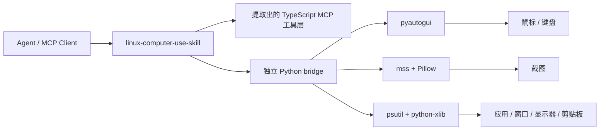

<div align="center">
  
  <h1>Linux Computer-Use Skill</h1>
  <p><strong>一个面向 Linux 的顶级 skill，内置独立 runtime 与 MCP server。</strong></p>
  <p>
    <a href="https://github.com/wimi321/linux-computer-use-skill">GitHub</a>
    ·
    <a href="https://clawhub.ai/wimi321/computer-use-linux">ClawHub</a>
    ·
    <a href="./README.md">English</a>
    ·
    <a href="./README.ja.md">日本語</a>
  </p>
</div>

## ClawHub 安装

这个 skill 已发布到 ClawHub，slug 是 [`computer-use-linux`](https://clawhub.ai/wimi321/computer-use-linux)。

```bash
clawhub install computer-use-linux
```

## 项目定位

这个仓库同时是：

- 一个顶级 `skill`
- 一套独立的 Linux 桌面控制 runtime
- 一个给 agent 生态使用的 computer-use MCP server

它是 skill-first，不依赖本机 Claude 安装。

## 这个项目解决什么问题

目标仍然是：

- 不依赖本机 Claude
- 不依赖私有 `.node` 二进制
- 不依赖提取内部隐藏资产
- skill 装上、server 构建好，就能直接用

## 你现在拿到的能力

- 顶级 Linux computer-use skill
- 独立 MCP server：截图、鼠标、键盘、应用启动、窗口/显示器映射、剪贴板
- 只使用公开依赖：`Node.js + Python + pyautogui + mss + Pillow + psutil + python-xlib`
- 首次运行自动自举：自动创建虚拟环境并安装 Python 依赖
- 安装 skill 时会把完整项目一起复制到 `~/.codex/skills/computer-use-linux/project`
- 提取出来的 TypeScript 工具层已经接到 Linux 原生 Python backend

## 当前状态

这个仓库里已经完成：

- Linux Python helper 和 runtime 自举链路
- 显示器枚举与截图链路
- 鼠标、键盘、拖拽、滚动、剪贴板能力
- 前台应用、指针下应用、运行中应用、已安装应用、窗口归属显示器查询
- Linux skill 打包与 bundled project 分发
- TypeScript 构建通过

上线前仍然建议：

- 在真实 Linux 机器上做验证
- 覆盖不同桌面环境、多显示器和焦点边界情况
- 补测剪贴板、窗口聚焦和权限限制细节

这一轮会话没有接入真实 Linux 主机，所以这里是“实现完成并已构建”，但还不是“已在 Linux 实机全链路验证”。

## 0.1.1 修复了什么

`0.1.1` 修复了 Linux 打包迁移中的共享平台逻辑问题：系统快捷键黑名单和工具 platform 类型被改坏后，Linux 构建并没有明确使用 Linux 自己的系统级快捷键保护分支。

现在这部分逻辑已经恢复为显式支持 `linux`，并且源码树与 bundled skill payload 都已同步修复。

## 重要范围

当前桌面控制能力主要面向 `X11` 会话。

含义是：

- X11 桌面会话是当前主目标
- Wayland 可能因为 compositor 策略限制截图、焦点查询、剪贴板和模拟输入
- 不同发行版 / 桌面环境之间也可能存在差异

## 架构



## 安装

### 1. 克隆并安装 Node 依赖

```bash
git clone https://github.com/wimi321/linux-computer-use-skill.git
cd linux-computer-use-skill
npm install
npm run build
```

### 2. 启动 server

```bash
node dist/cli.js
```

首次启动时项目会自动：

- 创建 `.runtime/venv`
- 必要时自动补 `pip`
- 根据 `runtime/requirements.txt` 安装 Python 依赖

## MCP 配置

```json
{
  "mcpServers": {
    "computer-use": {
      "command": "node",
      "args": [
        "/absolute/path/to/linux-computer-use-skill/dist/cli.js"
      ],
      "env": {
        "CLAUDE_COMPUTER_USE_DEBUG": "0",
        "CLAUDE_COMPUTER_USE_COORDINATE_MODE": "pixels"
      }
    }
  }
}
```

参考 [`examples/mcp-config.json`](./examples/mcp-config.json)。

## Skill 安装

仓库自带顶级 skill：[`skill/computer-use-linux`](./skill/computer-use-linux)

### 方式 A：从 ClawHub 安装

```bash
clawhub install computer-use-linux
```

```bash
bash skill/computer-use-linux/scripts/install.sh
```

安装后 bundled project 默认位于：

```text
~/.codex/skills/computer-use-linux/project
```

如果设置了 `CODEX_HOME`，则使用对应路径。

## 验证矩阵

这次会话里已经完成：

- `npm run check`
- `npm run build`
- `runtime/linux_helper.py` 的 Python 编译检查
- bundled skill 源码完整性检查
- bundled project 版本同步检查
- 对 Linux/X11 运行时中显示器发现、截图、剪贴板、前台应用、应用枚举、窗口/显示器映射路径的代码审视

这次还没有真实完成：

- Linux 实机 GUI 控制
- Linux 实机截图采集
- 面向真实 Linux 应用的前台窗口 gating
- 不同 Wayland compositor 下的行为
- 不同桌面环境和多显示器边界情况

## 运行说明

### 权限

Linux 桌面控制仍可能受这些因素限制：

- Wayland compositor 限制
- sandbox 应用隔离
- 会话 / 远程桌面边界
- 桌面环境在焦点和剪贴板上的差异行为

### 截图过滤

当前 runtime 声明的是 `screenshotFiltering: none`。

也就是说，截图过滤不是 compositor 原生级别，动作 gating 仍由 MCP 层处理。

### 平台范围

当前仓库明确是 `Linux-only`。

覆盖能力：

- 截图
- 鼠标控制
- 键盘输入
- 前台应用识别
- 已安装 / 运行中应用发现
- 窗口到显示器映射
- 剪贴板访问
- 应用启动

## 仓库结构

```text
src/
  computer-use/
    executor.ts
    hostAdapter.ts
    pythonBridge.ts
  vendor/computer-use-mcp/
runtime/
  linux_helper.py
  requirements.txt
skill/
  computer-use-linux/
examples/
assets/
```

## 路线图

- 在真实 Linux 硬件上继续打磨和加固
- 改进 Linux 应用身份识别与图标提取
- 增加自动化 Linux 集成测试
- 补齐 Wayland 限制和替代路径说明

## License

MIT

## Credits

这个项目保留了从 Claude Code computer-use 工作流中提炼出来的可复用 TypeScript 逻辑，并用一套完全独立、公开可安装的 Linux runtime 替换了缺失的私有执行层。
