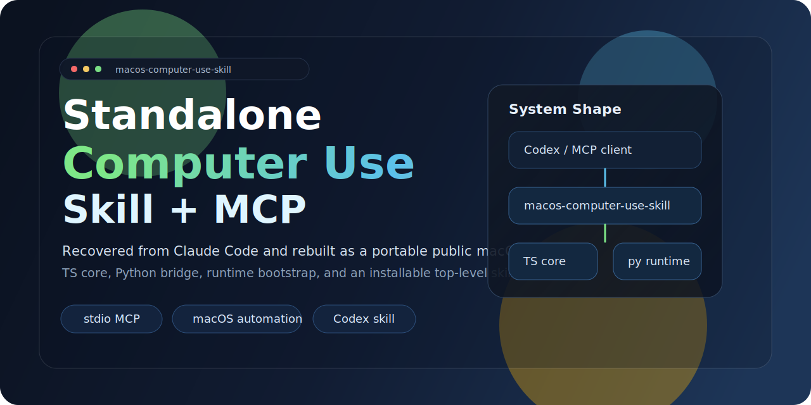
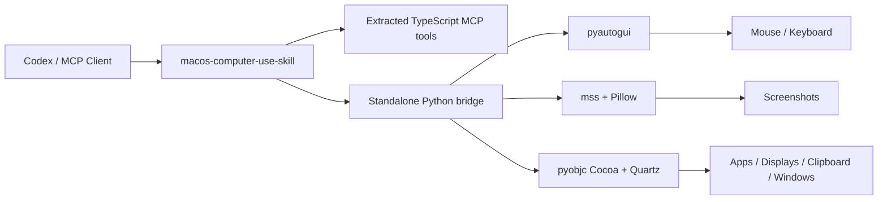

<div align="center">
  
  <h1>macOS Computer-Use Skill</h1>
  <p><strong>A top-level portable skill for macOS with a bundled standalone runtime and MCP server.</strong></p>
  <p>
    <a href="https://github.com/wimi321/macos-computer-use-skill">GitHub</a>
    ·
    <a href="https://clawhub.ai/wimi321/computer-use-macos">ClawHub</a>
    ·
    <a href="./README.zh-CN.md">简体中文</a>
    ·
    <a href="./README.ja.md">日本語</a>
  </p>
</div>

## Install From ClawHub

Published on ClawHub as [`computer-use-macos`](https://clawhub.ai/wimi321/computer-use-macos).

```bash
clawhub install computer-use-macos
```

If you want the source repo as well, keep reading for the full GitHub setup.

## Positioning

This repository is best understood as:

- a top-level `skill`
- a bundled standalone macOS runtime
- a computer-use MCP server for agent ecosystems

It is not just for Codex. The skill packaging is intentionally portable, so the same project can be adapted for ecosystems that consume skill-style distributions.

## Why This Project Exists

The original Claude Code computer-use stack was excellent, but the user requirement here was stricter:

- no piggybacking on a local Claude install
- no private `.node` binaries
- no "works if you already extracted internal assets"
- install the skill, launch the server, and use it

This repository now delivers exactly that on macOS.

## What You Get

- top-level macOS computer-use skill
- standalone MCP server for screenshots, mouse, keyboard, app launch, display switching context, and clipboard
- public dependency chain only: `Node.js + Python + pyautogui + mss + Pillow + pyobjc`
- first-run runtime bootstrap: the server creates its own virtualenv and installs dependencies automatically
- bundled skill install that copies the full project into `~/.codex/skills/computer-use-macos/project`
- extracted TypeScript tool layer from the original computer-use workflow, re-wired to a fully independent backend

## Current Status

This repository has been validated locally on a real macOS machine with:

- runtime bootstrap
- permission checks
- display enumeration
- screenshot capture
- frontmost app detection
- app-under-point lookup
- window-to-display resolution
- clipboard read/write
- MCP `type` tool GUI typing smoke tests
- MCP server startup

## What Was Fixed In 0.2.2

During real-device testing, we hit a macOS-specific bug: under a Chinese IME/input source, ordinary ASCII text could be corrupted when the tool typed one key at a time.

Version `0.2.2` fixes that by preferring clipboard-routed typing on macOS for normal multi-character text when clipboard write is available. That keeps the standalone skill usable even when the current input source is not plain U.S. keyboard mode.

## Architecture



## Install

### 1. Clone and install Node deps

```bash
git clone https://github.com/wimi321/macos-computer-use-skill.git
cd macos-computer-use-skill
npm install
npm run build
```

### 2. Start the server

```bash
node dist/cli.js
```

On first launch, the project will automatically:

- create `.runtime/venv`
- bootstrap `pip` if needed
- install the Python runtime dependencies from `runtime/requirements.txt`

No Claude desktop app. No private native modules. No local extraction path required.

## MCP Configuration

Example config:

```json
{
  "mcpServers": {
    "computer-use": {
      "command": "node",
      "args": [
        "/absolute/path/to/macos-computer-use-skill/dist/cli.js"
      ],
      "env": {
        "CLAUDE_COMPUTER_USE_DEBUG": "0",
        "CLAUDE_COMPUTER_USE_COORDINATE_MODE": "pixels"
      }
    }
  }
}
```

See [`examples/mcp-config.json`](./examples/mcp-config.json).

## Skill Install

This repo ships a top-level skill at [`skill/computer-use-macos`](./skill/computer-use-macos).

You can install it either from ClawHub or from this repository.

### Option A: Install from ClawHub

```bash
clawhub install computer-use-macos
```

### Option B: Install from the repo

Install it with:

```bash
bash skill/computer-use-macos/scripts/install.sh
```

The installer copies:

- the skill metadata
- the bundled standalone project
- the runtime bootstrap files

After installation, the default project path becomes:

```bash
~/.codex/skills/computer-use-macos/project
```

That means the installed skill can work even if the original clone disappears.

## Runtime Notes

### Permissions

macOS still requires:

- Accessibility
- Screen Recording

The standalone host checks both and reports them through the MCP flow.

### Screenshot Filtering

This standalone runtime reports `screenshotFiltering: none`.

That means:

- screenshots are not compositor-filtered
- the original allowlist / permission / tier logic still protects actions at the MCP layer

### Platform Scope

This project is intentionally focused on `macOS` desktop computer use. The current runtime is not a Windows or Linux backend.

Covered capabilities:

- screenshots
- mouse control
- keyboard input
- frontmost app inspection
- installed/running app discovery
- window-to-display mapping
- clipboard access
- app launch

## Validation Matrix

Real tests completed on this Mac:

- `npm run check`
- `npm run build`
- Python helper compile check for `runtime/mac_helper.py`
- permission probe: Accessibility + Screen Recording both granted
- display discovery on the active display
- real screenshot capture from the desktop
- running / installed app enumeration
- frontmost-app detection
- bundled skill install into a clean `CODEX_HOME`
- bundled project `npm install && npm run build`
- real GUI typing round-trip through the MCP `type` tool into TextEdit with exact clipboard verification

## Example Commands

```bash
npm run build
node dist/cli.js
```

```bash
node --input-type=module -e "import { callPythonHelper } from './dist/computer-use/pythonBridge.js'; console.log(await callPythonHelper('list_displays', {}));"
```

## Repository Layout

```text
src/
  computer-use/
    executor.ts
    hostAdapter.ts
    pythonBridge.ts
  vendor/computer-use-mcp/
runtime/
  mac_helper.py
  requirements.txt
skill/
  computer-use-macos/
examples/
assets/
```

## Environment Flags

Optional knobs:

- `CLAUDE_COMPUTER_USE_DEBUG=1`
- `CLAUDE_COMPUTER_USE_COORDINATE_MODE=pixels`
- `CLAUDE_COMPUTER_USE_CLIPBOARD_PASTE=1`
- `CLAUDE_COMPUTER_USE_MOUSE_ANIMATION=1`
- `CLAUDE_COMPUTER_USE_HIDE_BEFORE_ACTION=0`

## Roadmap

- richer app-icon extraction without private APIs
- stronger app filtering for nested helper bundles
- broader automated MCP integration tests
- optional packaged release artifacts for easier distribution

## License

MIT

## Credits

This project preserves and adapts reusable TypeScript computer-use logic recovered from the Claude Code workflow, then replaces the missing private runtime with a fully standalone public macOS implementation.
